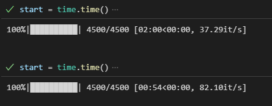
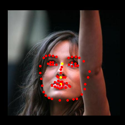

# Face Alignment Model w/ TensorRT
## Overview
This repository provides a solution to enhance the inference time of [original repo](https://github.com/1adrianb/face-alignment) models by converting them to TensorRT. TensorRT is a high-performance deep learning inference library developed by NVIDIA, and it optimizes the models for deployment on NVIDIA GPUs.

## Performance Improvement

The image above demonstrates the significant improvement in inference time achieved by converting a model to TensorRT. The top section represents the normal version with an inference speed of 37.3 iterations per second (it/s), while the bottom section depicts the TensorRT version, which achieves an impressive 82.1 it/s. This results in nearly a two-fold improvement in performance.

### original result


### after tensorrt result


## Limitations
Currently, the TensorRT conversion in this repository is tailored for 2D landmark detection models. Additionally, the implementation is designed to work only with a batch size of 1. Attempts to increase the batch size may lead to unexpected output issues after convert to TensorRT.

## Getting Started
1. convert model
```
python convert_to_tensorrt.py
```

2. run
```
python test_tensorrt.py
```